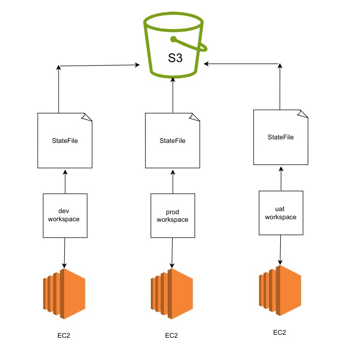

```
terraform apply --var-file dev.tfvars
terraform apply --var-file uat.tfvars
```

```
OUTPUT:


# aws_subnet.subnet1-public will be updated in-place
  ~ resource "aws_subnet" "subnet1-public" {
        id                                             = "subnet-02df73516f6099bc3"
      ~ tags                                           = {
          ~ "Name" = "Terraform_Public_Subnet1-dev" -> "Terraform_Public_Subnet1-uat"
        }
      ~ tags_all                                       = {
          ~ "Name" = "Terraform_Public_Subnet1-dev" -> "Terraform_Public_Subnet1-uat"
        }
        # (19 unchanged attributes hidden)
    }

It Shows dev is replaced with uat. Means changes made in same state file. 
```
```
terraform destroy --auto-approve --var-file dev.tfvars

```
Manually delete statefile from S3 bucket.

```
terraform workspace list
terraform workspace new dev
terraform workspace new uat
terraform workspace new prod

Check S3 bucket
```
```
terraform workspace select dev
terraform init
terraform apply --var-file dev.tfvars

terraform workspace select uat
terraform init
terraform apply --var-file uat.tfvars

terraform workspace select prod
terraform apply --var-file prod.tfvars
```
Three EC2 instances got created. Check there public address output on browser.

To delete a workspace, you must not be in that workspace.
```
terraform workspace list
terraform destroy --var-file uat.tfvars
terraform destroy --auto-approve --var-file dev.tfvars
terraform workspace select default
terraform destroy --auto-approve --var-file prod.tfvars

```

```

terraform workspace delete uat


Error: Workspace is not empty
│ 
│ Workspace "uat" is currently tracking the following resource instances:
│   - aws_internet_gateway.default
│   - aws_vpc.default
│   - aws_subnet.subnet1-public
│   - aws_instance.web-1
│   - aws_security_group.allow_all
│   - aws_route_table.terraform-public
│   - aws_subnet.subnet2-public
│   - aws_subnet.subnet3-public
│   - aws_route_table_association.terraform-public
│ 
│ Deleting this workspace would cause Terraform to lose track of any associated remote
│ objects, which would then require you to delete them manually outside of Terraform. You
│ should destroy these objects with Terraform before deleting the workspace.
│ 
│ If you want to delete this workspace anyway, and have Terraform forget about these managed
│ objects, use the -force option to disable this safety check.
╵

```

```
terraform workspace select uat
terraform destroy --auto-approve --var-file uat.tfvars
terraform workspace select dev
terraform destroy --auto-approve --var-file dev.tfvars

```
Empty S3 bucket
